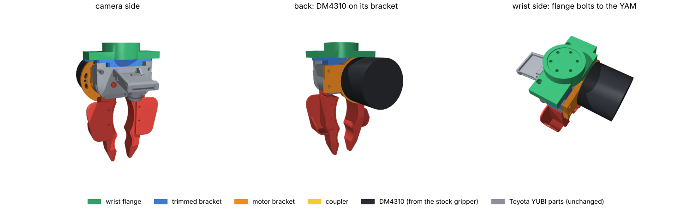
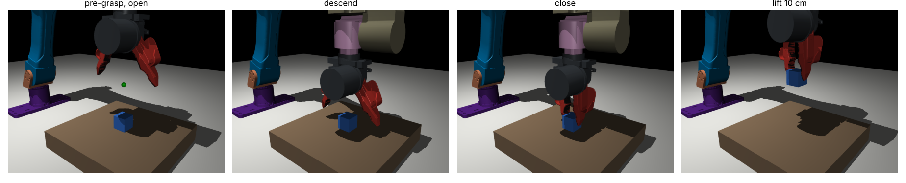
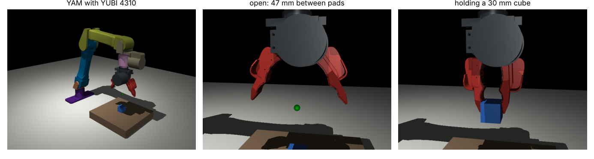

# yubi-yam

Toyota / AIRoA's [YUBI](https://yubi.airoa.io/) robot gripper, adapted to the
[I2RT YAM](https://i2rt.com/products/yam-6-dof-arm) arm and driven by the DM4310 from
the YAM's stock gripper. It runs on the arm's own CAN bus and 24 V, so there's no
Dynamixel, no U2D2, no extra power supply and no extra cable down the arm.

The fingers, gears, camera and camera mount are Toyota's design, unchanged. So the
wrist camera sees the same thing as on a YUBI handheld, and data collected with the
YUBI glove (or Toyota's dataset) matches what this gripper sees on the robot.



## Status

Designed and simulated, **not built yet**.

| What | How it was checked | Result |
|---|---|---|
| New parts fit Toyota's parts and the motor | exact B-rep boolean intersection, every pair (`cad/build.py`) | no overlap |
| Finger travel | exact-mesh collision sweep of both fingers (`sim/finger_sweep.py`) | closed −5.5° (pads touch) to open 36°: **47 mm** between pads, 41.5° of motor travel; new parts never limit it |
| i2RT SDK integration | patch + config installed into a copy of the SDK, then `get_yam_robot(gripper_type=YUBI_4310, sim=True)` | gripper command 0 → 1 drives the finger joint closed → open |
| Grasping | MuJoCo physics: reach down, close on a 30 mm, 50 g cube, lift 10 cm | cube lifts 10 cm, ~17 N pad force at the default gain |
| Reach | exact-mesh collision of the gripper against the arm links over 2,067 poses, compared with the stock gripper | about the same as stock: 256 vs 261 colliding pose/link pairs, all at extreme joint combinations |




### Assumptions to check on the real arm

**Checked on the real gripper motor (Oct 9).** The YAM's gripper motor (label
RD-J10D) has the DM4310 face the parts assume: housing Ø57, rotor Ø35, 6× M3 on a
27 mm circle in the rotor (≥7.5 deep), 6× M3 on a 50 mm circle in the front ring
(~4.8 deep). It also has locating pins the reference model lacked: 2× Ø4 on the rotor
(4.2 proud, 23.1 mm circle, 120° apart) and 2× Ø3 on the ring (5.5 proud, opposite
each other, 15° from a screw hole). The coupler has pockets for the rotor pins and the
motor bracket has slots for the ring pins.

1. **Wrist screw pattern.** i2RT doesn't publish it, and their meshes have no holes.
   The flange assumes the gripper bolts straight onto the wrist's DM4310 rotor
   (6× M3 on a 27 mm circle around a 35 mm boss); the YAM's last link is 57 mm wide,
   the 4310's diameter. Take the stock gripper off and look. If it differs, change
   `WristInterface` at the top of `cad/build.py` and run `./run_all.sh`. Nothing else
   depends on it.
2. **Wrist face position.** The sim puts the flange face where i2RT's gripper frame
   starts. If the real face sits a few mm away, the tool point in sim is off by that
   much; the hardware is unaffected.
3. **Motor polarity.** Closing should increase the motor reading, as on the stock
   gripper. If the fingers open when commanded closed, set `motor_direction: -1` in
   `yubi_4310.yml`.
4. **Grip force.** `motor_kp: 10` gives roughly 15 N at the pads per N·m of motor
   torque error. Tune it on the real gripper.

## What changes from Toyota's design

| Toyota part | Here |
|---|---|
| Dynamixel XM430-W350-R | DM4310 from the stock YAM gripper |
| Dynamixel horn | `coupler`: DM4310 rotor (6× M3, PCD 27) → YUBI gear shaft. Copies the horn interface, so Toyota's shaft and screws stay unchanged |
| `BRACKET_DYNAMIXEL` | `motor_bracket`: holds the 4310 by its front ring and bolts to the case's existing M2 inserts; the side tab is Toyota's geometry. Has a relief for the thick right finger pad, which reaches 3 mm behind the case |
| `BRACKET_GRIPPER` (machined) | `bracket_trimmed`: the same part, cut back where the bigger motor sits; printable |
| `UR5e_FLANGE` | `yam_flange`: YAM wrist → bracket; also supports the motor bracket from below |

Everything else is built exactly as in Toyota's
[YUBI gripper assembly guide](https://github.com/Toyota/yubi-hw/tree/main/docs/AssemblyInstruction).

The 4310 is bigger and heavier than the Dynamixel (Ø57 × 46 mm, 325 g vs 82 g), so it
hangs behind the case. The whole gripper comes out at about 0.63 kg (stock linear
gripper: about 0.70 kg), with the grasp point 143 mm from the wrist face (stock: 145 mm).

## Build

> **Weekend / first build:** a fully printed version of the gripper and the gloves,
> using only parts available in the US within a couple of days, is described in
> [docs/PRINTED_PROTOTYPE.md](docs/PRINTED_PROTOTYPE.md). The sections below are the
> proper build.

### Print

STEP and STL files are in `cad/out/` (in Toyota's assembly coordinates; STEP is best
for re-orienting in a slicer). PETG or PLA+, 3 walls.

| Part | Orientation | Infill | Note |
|---|---|---|---|
| `yam_flange` | wrist face down | 50 % | |
| `motor_bracket` | motor side down (side tab up) | 60 % | carries the motor's torque |
| `bracket_trimmed` | flat, as Toyota's | 50 % | or machine it in aluminium like Toyota |
| `coupler` | rotor side down | 100 % | or machine it in aluminium; it carries the full gripper torque |

Plus Toyota's printed gripper parts (case, upper plate, fingers, pads, flaps), per
their BOM and print settings.

### Hardware beyond Toyota's BOM

The full shopping list, with MISUMI part numbers and US sources, is in
[docs/BOM_US.md](docs/BOM_US.md).
The [proposed October 9 shopping list](docs/SHOPPING_LIST_2026-10-09.md) records the
prepared vendor carts, printed-prototype substitutions, Hayward pickup and
unconfirmed delivery details. Nothing has been ordered.

| Joint | Qty | Fastener |
|---|---|---|
| wrist flange → YAM wrist | 6 | M3×10 socket head (if the wrist is the assumed 4310 pattern) |
| coupler → DM4310 rotor | 6 | M3×6 low head (DIN 7984) |
| DM4310 → motor bracket | 4 | M3×8 low head (DIN 7984) |
| motor bracket → case back | 2 | M2×8 low head, into the case's existing M2 inserts |
| flange + bracket → upper plate | 2 | M3×12 socket head (replaces Toyota's M3×8 there) |
| inserts | 4 + 2 | M2 heat-set, 3.0 mm OD × 3 mm (as Toyota's SB-203030) in the coupler; M3 heat-set, 4 mm OD × 5 mm in the flange |

Reused from Toyota's BOM: the shaft-to-horn screws (now into the coupler), the
side-tab screws, and the two bracket screws at the flange's ears. Not needed: the
Dynamixel and its screws, the UR5e flange and its screws and pins.

### Assemble

1. Take the stock gripper off the YAM and check the wrist pattern (see above). Take
   the DM4310 out of the stock gripper.
2. Coupler onto the 4310 rotor (6× M3×6). 4310 onto the motor bracket (4× M3×8,
   heads in the counterbores on the case side).
3. Toyota's gear shaft onto the coupler with its 4 M2 screws, as it went onto the horn.
4. Build Toyota's gripper with `bracket_trimmed` in place of `BRACKET_GRIPPER`. Where
   their guide fits the Dynamixel, slide the shaft in and screw the motor bracket to
   the case (2× M2 at the back, 2× M2 into the side).
5. Wrist flange onto the YAM (6× M3×10).
6. Gripper onto the flange: 2× M3×8 from the top through the bracket ears, 2× M3×12
   from below through flange and bracket into the upper plate.
7. Plug the 4310 into the wrist connector the stock gripper used, and run the camera's
   USB cable along the arm.

## Software

```bash
git clone https://github.com/i2rt-robotics/i2rt
./sdk/install.sh ../i2rt        # 4-line patch + config + MuJoCo model
```

```python
from i2rt.robots.get_robot import get_yam_robot
from i2rt.robots.utils import GripperType

robot = get_yam_robot(channel="can0", gripper_type=GripperType.YUBI_4310)
```

It's the same motor on the same CAN ID as the stock gripper. On first start the SDK
calibrates the gripper the same way it does the stock one: it drives gently to the
closed stop (pads touching) and the open stop (fingers against the case). Because the
travel is less than one motor turn, you can then write the measured limits into
`gripper_limits` in `yubi_4310.yml` and set `needs_calibration: false`.

The patch was made against i2rt `120c3c8` (pinned in `third_party/i2rt`).

## Reproduce

```bash
git submodule update --init
pip install -r requirements.txt
./run_all.sh
```

| Step | Script | Output |
|---|---|---|
| parts, interference check, sim meshes | `cad/build.py` | `cad/out/`, `sim/assets/` |
| finger travel | `sim/finger_sweep.py` | `sim/finger_travel.json` |
| i2RT model + config | `sim/build_model.py` | `sdk/overlay/` |
| SDK, grasp and reach checks | `sim/check_sim.py` | `sim/check_report.json`, `docs/img/` |

All dimensions come from published CAD:

- **YUBI:** Toyota's STEP files, exact.
- **YAM:** i2RT's MuJoCo models.
- **DM4310:** checked against Damiao's model as published in OpenArm v1.1 (used for
  measurements only; this repo doesn't contain it).

## Layout

```
cad/build.py           parametric parts, built from Toyota's CAD
cad/out/               STEP + STL of the new parts, build_summary.json
cad/printed.py         fully printed prototype parts -> cad/out/printed/
cad/vendor/            Adafruit AS5600 board model (MIT) for the glove fit check
sim/                   travel sweep, i2RT model generator, checks
sdk/                   i2RT patch, overlay (config, model, meshes), install.sh
docs/                  parts list, printed-prototype guide, figures
third_party/yubi-hw    Toyota's YUBI hardware (submodule)
third_party/i2rt       i2RT SDK (submodule)
```

## Licence

Hardware design files (`cad/`, the meshes in `sim/assets/` and `sdk/overlay/`) are
derived from Toyota's YUBI and released under
[CERN-OHL-W-2.0](LICENSE), like the original. Code is under [MIT](LICENSE-MIT). See
[NOTICE.md](NOTICE.md) for credits.
