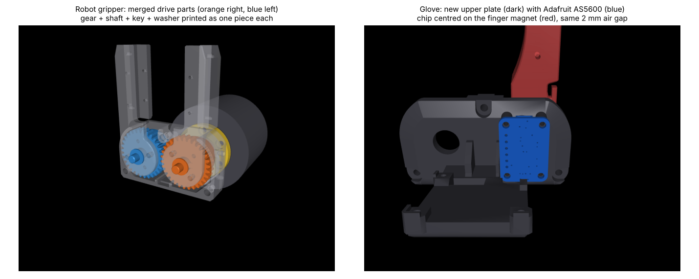

# Printed prototype (weekend build)

A first build of the YAM gripper and the gloves, made only from printed parts and
parts available within a couple of days in the US. It lets us test the mechanics,
wiring, Quest tracking and recording before the precision parts arrive.
The proper build (MISUMI gears and shaft, NSK bearings, machined adapters) replaces
it later; the glove is already the final design apart from its encoder board.

Generated by `python3 cad/printed.py` (all files in `cad/out/printed/`), which also
checks every new part for interference against the Toyota assemblies (robot gripper,
left glove, right glove). Figure: `python3 docs/make_printed_figure.py`.

## Robot gripper: what changes

| Proper build | Printed prototype |
|---|---|
| Toyota `GEAR_SHAFT` (A2024) + MISUMI gear + key + washer | **`drive_R_printed`**: one printed part with the same outside shape |
| MISUMI stepped shaft + gear + key + 2 washers | **`drive_L_printed`**: one printed part |
| 3× NSK MTA05-13ZZ DBS (5×13×5) | 3× **695ZZ** (5×13×4) + 3× **`bearing_shim_1mm`** (one in each bearing seat, under the outer race) |
| machined coupler, motor bracket, trimmed bracket, wrist flange | printed from `cad/out/*.stl` as before (they were designed for heat-set inserts) |
| diamond locating pin (late) | leave out; the screws locate the parts well enough for a prototype |

Everything else (case, upper plate, finger attachments, pads, flaps) is Toyota's
printed design, as in the proper build.

**Printing the drive parts:** axis vertical, flange/large end on the bed, tree
supports under the gear. PETG or PLA+, 100 % infill, 0.12 mm layers for the teeth.
The Ø5 bearing journals usually print slightly oversize: sand or turn them in a drill
until the 695ZZ slides on with light force. The M3 holes in the gear face are at
tap-drill size; the finger-attachment screws self-tap into them.

**Go easy on the motor.** A DM4310 can strip printed teeth and twist a printed Ø8
shaft (roughly 3 N·m for PLA). Keep the default soft gains (`motor_kp 10`,
`motor_kd 0.3` in `yubi_4310.yml`) and limit the motor current so grip torque stays
around 1 N·m (about 12 N at the pads), which is enough for wires and connectors.

## Glove: AS5600 instead of AS5601

Toyota's encoder board (Switch Science #3494, AS5601) ships from Japan. The
prototype, and the final glove if it works well, uses the
**[Adafruit 6357 AS5600 breakout](https://www.adafruit.com/product/6357)** instead:

- **Firmware unchanged.** AS5600 and AS5601 share the I2C address (0x36) and every
  register yubi-sw's `ESP32C6_AS5601` firmware reads (status 0x0B, raw angle 0x0C,
  AGC 0x1A, magnitude 0x1B), so the firmware works without changes.
- **New upper plate, `glove_upper_plate_as5600`.** Toyota's plate with the two AS5601
  bosses removed and four new bosses that match the Adafruit board's corner holes.
  The board sits exactly where the AS5601 was: chip centred on the finger magnet,
  same 2.0 mm air gap, components facing the magnet, 1.5 mm clear of the finger.
  One plate fits both hands; Toyota uses the same upper plate for left and right.
- **Mounting:** 4× M2×6 socket head screws, self-tapping into the bosses (Ø1.7 pilots).
  Use the M2-only screw kit on the parts list, which explicitly lists 30 M2×6 screws.
  The original 888-piece mixed kit has M2×12/16 only and does not cover this mount.
  The two original CBSTNR3-5 encoder-mount screws per glove are no longer needed.
- **Wiring:** solder four wires to the header pads on the back (VIN to 3V3, GND, SCL,
  SDA) and run them to the XIAO as in Toyota's wiring. The STEMMA QT sockets face the
  magnet side and aren't used.
- **Magnet:** Ø6 × 2.5 mm, **diametrically** magnetised (DigiKey Radial Magnets 9042),
  in the finger's magnet pocket. The Adafruit board ships without one.

The board model used for the fit check is Adafruit's own
(`cad/vendor/adafruit_6357_as5600.step`, MIT licence).

## Order list changes from the original proper-build BOM

These changes are incorporated in [BOM_US.md](BOM_US.md). The
[proposed shopping list](SHOPPING_LIST_2026-10-09.md) uses one robot and one right-hand
glove, with two encoder boards and two magnets explicitly requested for purchase.

| Change | Per gripper / glove |
|---|---|
| add 695ZZ bearings, 5×13×4 mm | 3 per gripper |
| add M5×0.8 × 70 mm socket head screw (stands in for the late AJKTNS5-70) | 1 per glove |
| encoder board: **Adafruit 6357** instead of MIKROE-4204 (the Mikroe board is 28.6×25.4 mm and doesn't fit the glove) | 1 per glove |
| add M2×6 socket head screws for the board (covered by the replacement M2-only kit) | 4 per glove; 12 total with the original 4 robot + 4 glove screws |
| remove CBSTNR3-5 encoder-mount screws | 2 per glove |
| Radial Magnets 9042 diametric magnet; not included with the board | 1 per glove; buy 2 per purchasing request |
| skip for now: gears, stepped shaft, keys, precision washers, NSK bearings, diamond pin, machining | |

## Print list per set

| Part | Source | Qty (1 gripper + 1 glove) |
|---|---|---|
| `drive_R_printed`, `drive_L_printed` | `cad/out/printed/` | 1 each |
| `bearing_shim_1mm` | `cad/out/printed/` | 3 |
| `coupler`, `motor_bracket`, `bracket_trimmed`, `yam_flange` | `cad/out/` | 1 each |
| case, upper plate, finger attachments L/R, pads, flaps | Toyota `STL/gripper` | per Toyota BOM |
| `glove_upper_plate_as5600` | `cad/out/printed/` (replaces Toyota's glove upper plate) | 1 |
| under plate, fingers with gear, flaps, grip, Quest holder, PCB/cable covers | Toyota `STL/glove`, `_R` or `_L` parts for the hand | per Toyota BOM |
